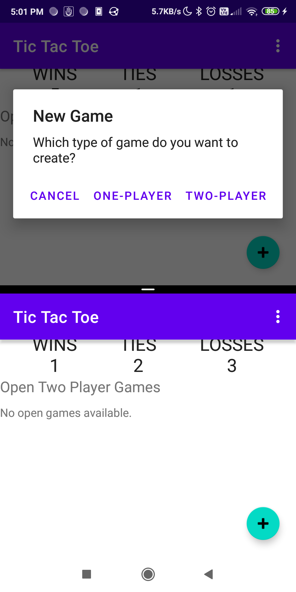
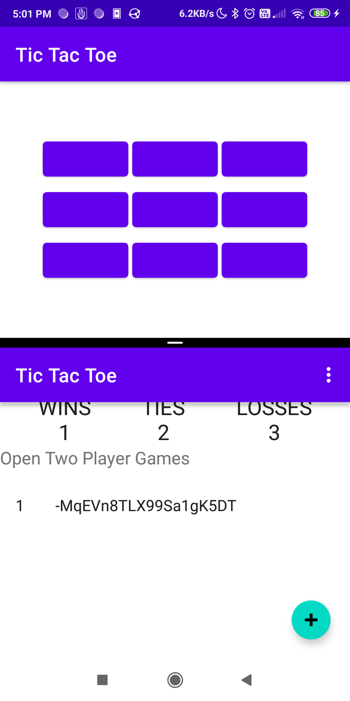
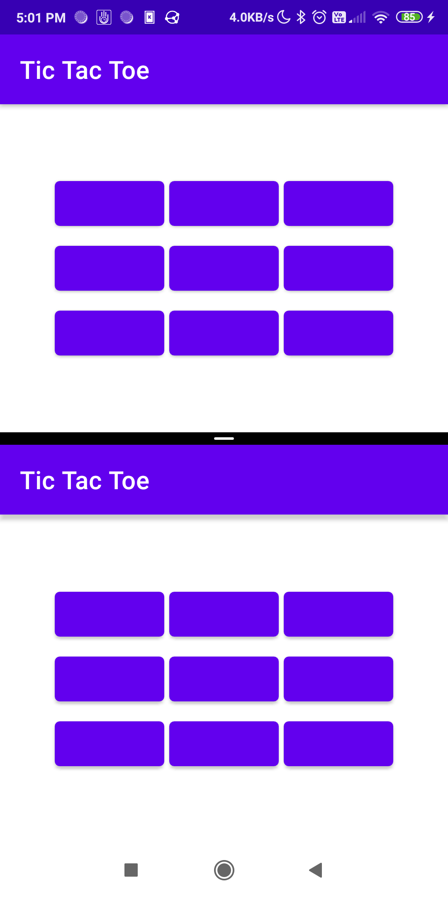
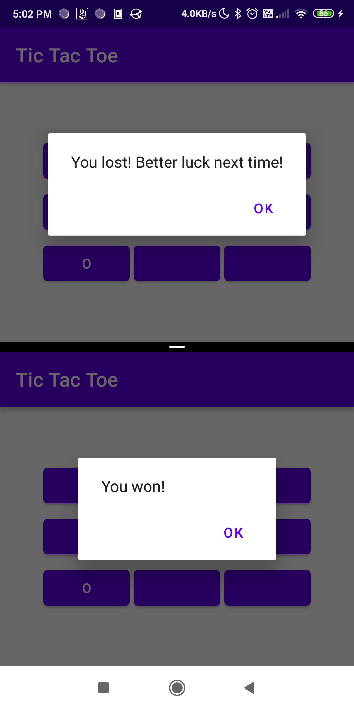
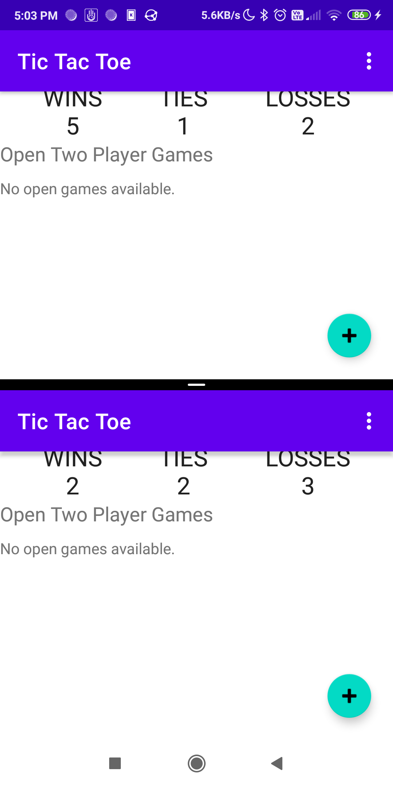

# A.a) Assignment Information

- Project name: Tic Tac Toe
- Name: Dhaval Pungaliya
- ID No: 2018B2A70662G
- Email: f20180662@goa.bits-pilani.ac.in

# A.b) App Description

This is a simple Tic-tac-toe game. The game features both single and two player modes. User's create an account and this is synced with a server. The player stats like wins/losses/ties are tracked using this account. Using the single player mode one can play against a computer based AI and using the two player mode one can play against another human user who is using their own device.

## Screenshots

The following are a sequence of screenshots that show a two player game from creation to finish. There are two distinct instances of the app running on the same device(using the dual apps feature) and the displayed in split screen mode. Both instances are communicating with each other over the internet using Firebase.

| | | |
|:-------------------------:|:-------------------------:|:---------------------:|
 |  | 
 |  | 
 | |

## Known Bugs

1. Players losing network connection is not handled properly during the games. For a single player game this can cause issues like player stats not updating after a game if the network access is lost in between the game and the app is closed/restarted before internet access is regained. For a two player game this can cause issues like player1 simply waiting for player2 to make their move if player2 has lost their network.
2. 


# A.c) Task Descriptions

I used Firebase as the backend for the app. All the user accounts, player stats, game details are stored and synced using Firebase.

## Task 1: Authentication, Dashboard and Creating New Games

I used the Firebase Auth module for authentication. It handles the password and email validation and manages user accounts on Firebase. I wrapped the user details, sign in and sign out functionality into a ViewModel that is shared over the activity. The signed in/signed out state is exposed as a LiveData that the Fragments observe. The navigation then is taken based on the changes in the observed value. The player stats (wins/losses/ties) are exposed using the UserDetailsViewModel as LiveData.

The Dashboard has its own ViewModel that exposes the list of open games as a LiveData. This is observed and displayed on the DashboardFragment. The UserDetailsViewModel is used to handle the sign out option in the DashboardFragment as well. The DashboardFragment too observes the login status LiveData from the UserDetailsViewModel and navigates back to the login page on sign out.

The FloatingActionButton on the DashboardFragment is used to create new games. A dialog is show on what type of game to create. The details on the type of game are passed to the GameFragment as arguments using SafeArgs.

## Task 2: Single Player Game

A GameViewModel was created to handle all the logic of the GameFragment. A game type independent `Game`  is used as the model for the game and is used by the GameViewModel. The `AIPlayer` class is used to create an instance of the local device based player(simply chooses a random empty location for each move). After each move, the status of the game is checked, if the game has ended, the appropriate dialogs are shown and the player stats are updated on the server.


## Task 3: Two Player Game

A player, the creator, creates a two player game on the server and the UID of this game is added to the open list of games on the server. The other player, the joiner, joins this game from the list of open games shown on their device. On joining, the joiner removes the game UID from the open games list and sets their user UID in the field for the joiner. This change informs the creator that the other player has joined and the game starts. Any move that is made is checked locally(to ensure that the no rules of the game are violated) and then the change is made in the server. These changes will be notified to the other player and the game goes on. Any win/loss/tie situation will be recognized locally based on the game state and code on each user's device will make the necessary updates to their respective stats.

# A.d) Running the App

There is setup required on the hosting side since Firebase is used as a backend and should always be running.
After running the app, enter an email(proper format) and password(more than 6 characters). If you have not created an account yet, hit `SIGN UP`, else hit `LOG IN`. Once the sign up or login is successful, you will be taken to the dashboard where you view your stats, create new games or join existing ones. 

The following accounts are already created (and they already have some wins/ties/losses associated with them) should you wish to use them:
```
test1@test.com 
test2@test.com
test3@test.com
```
The password for all of these accounts is: `test123`

# A.e) Testing and Accessibility

I did consider it, but since time was short I didn't do any testing(automated testing that is).

# A.f) Project Duration

Hours taken to complete the project-60

# A.g) Project Difficulty

Rating- 8
